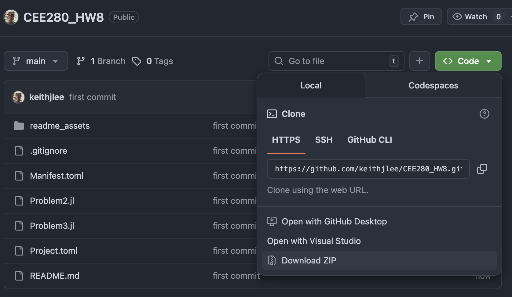
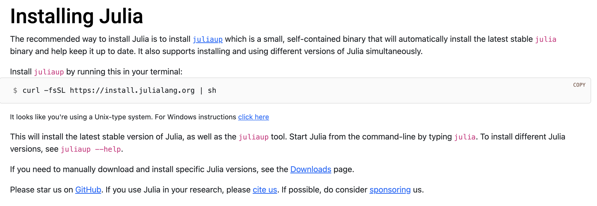
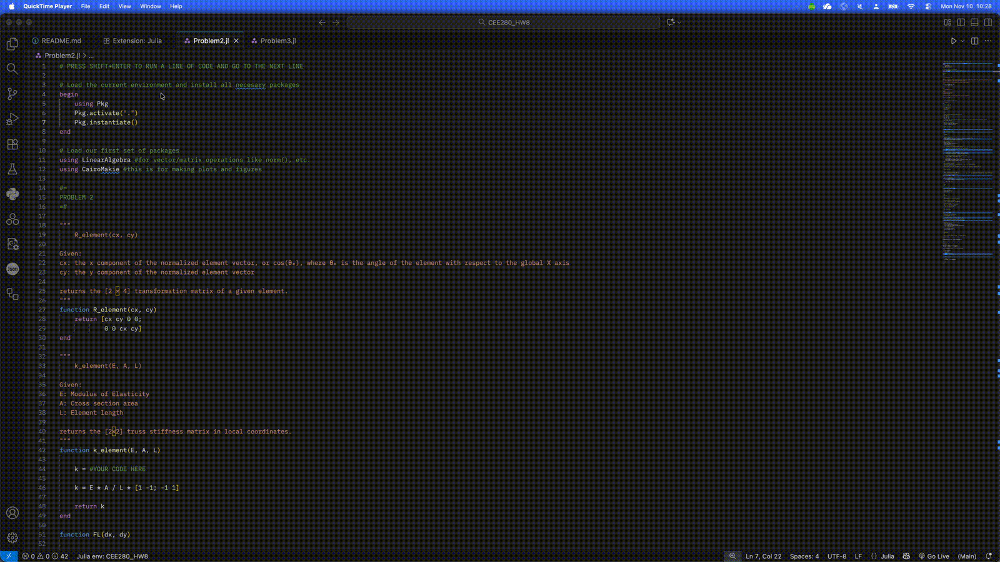
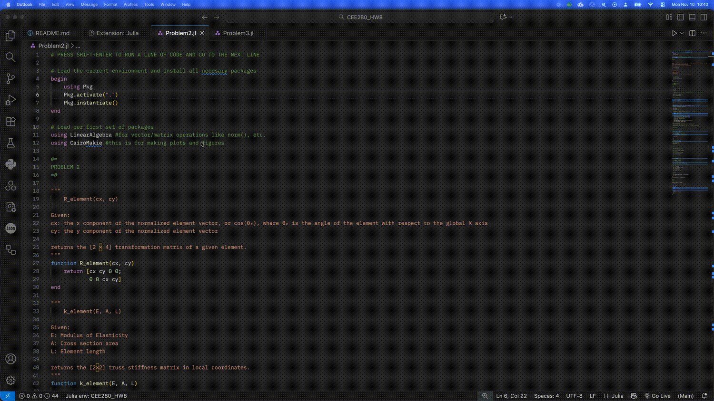

# CEE280 HW08 2025
For Stanford CEE280 - Prof. Gregory Deierlein.
Lectures on optimization by Keith J. Lee.

Begin by either cloning this repository using git, or downloading all files as a .zip folder:

 If using the latter, unzip the file. You should now have a folder that matches the contents of this repository.

# Installation instructions

## Julia
First install [Julia](https://julialang.org/install/). This will install the latest version of Julia (v1.12.1) as well as `juliaup`, a command line tool that will help you update versions in the future.

## VS Code
If Julia is the engine, a *text editor* is the steering wheel, pedals, and gear shifter.
Install [Visual Studio Code](https://code.visualstudio.com/), a very popular text editor.

## Download

## Setting up VS Code
Open VS Code and navigate to this folder (press `cmd/ctrl+o` for a file navigator dialogue), and install the Julia language extension from the Extensions toolbar on the left side of the window:

You may need to restart VS Code. You're now ready to program using Julia!

# Using Julia
Now navigate to `Problem2.jl`, and place your cursor anywhere inside the `begin/end` block at the top of the file and press `shift+enter`. A Julia instance should open up in VS Code and begin running the lines of code inside this block. If you are running this problem for the first time, it will install all the necessary packages for you to start working with the code base.

# Running code
- Keep hitting `shift+enter` to run a block of code and move to the next block. `ctrl+enter` will run a block of code and remain at the current position.
- Try adding your own code, modifying existing code, and running your changes inside the file.

The Julia terminal that appeared when you first started the file is the Julia REPL, akin to Matlab's console. This is the running Julia engine, where you send commands to it by pressing `shift+enter`. You can also work directly inside the REPL, recalling variables you have already defined, or treating it as a very smart calculator.

Try `shift-enter`ing your way through all of `Problem2.jl`

